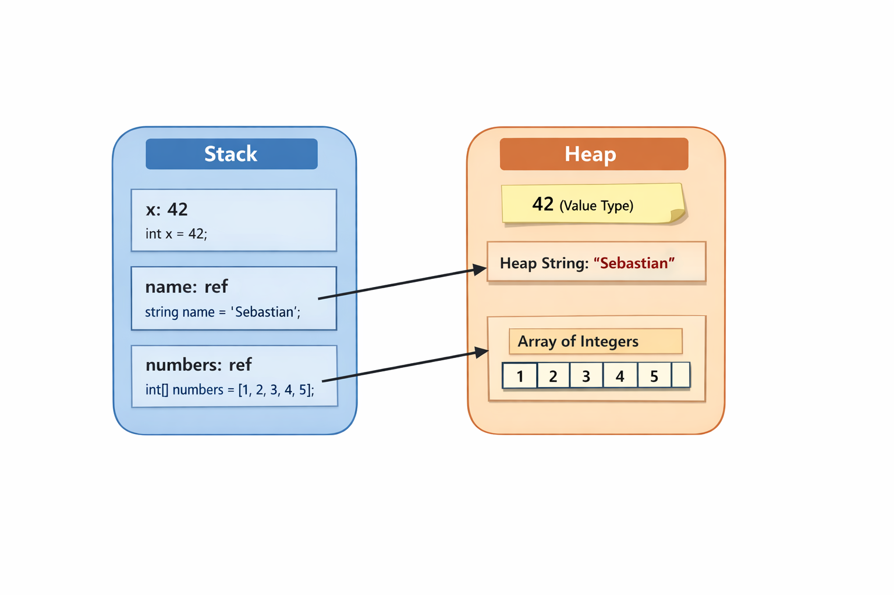

# Simple Memory Example (C#)

This repository contains a small C# example that demonstrates how **memory is organized**
between the **stack** and the **heap** in a typical C# program.

## Example Code

The following code is defined in `SimpleExample.cs`:

```csharp
int x = 42;
string name = "Sebastian";
int[] numbers = [1, 2, 3, 4, 5];
```

